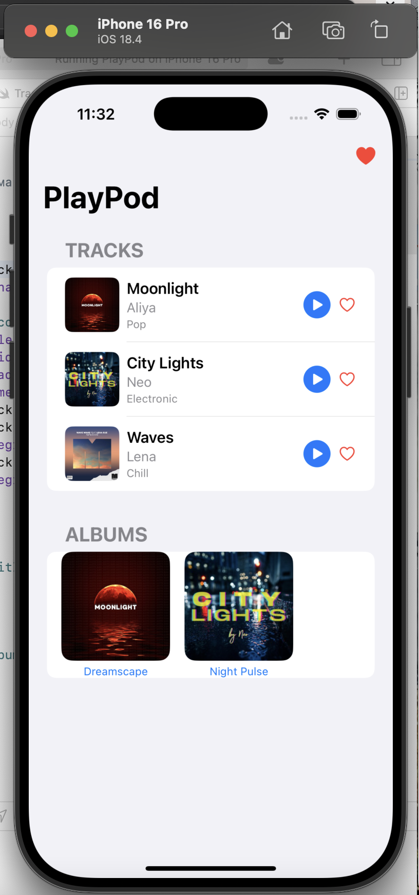

# PlayPod

PlayPod — это простое iOS-приложение для воспроизведения музыки, созданное на SwiftUI. Пока что начальная версия приложения как draft.
Пользователь может:

- Просматривать список треков и альбомов
- Воспроизводить, ставить на паузу и переключать треки
- Добавлять любимые песни в "Избранное"
- Смотреть мини-плеер снизу
- Открывать подробный экран трека с бегущей строкой и временем

# Использованные технологии

- SwiftUI
- AVFoundation
- @AppStorage, @EnvironmentObject
- Git + GitHub

##Скриншоты

Разработано Anel Anuash — [GitHub Profile](https://github.com/anelli07)