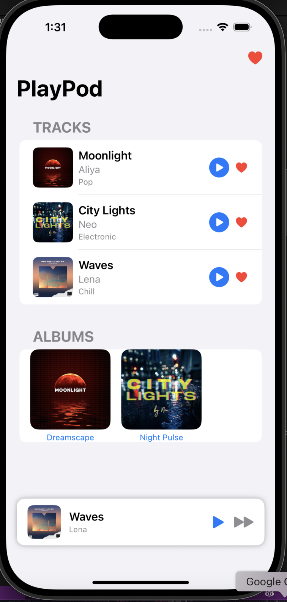
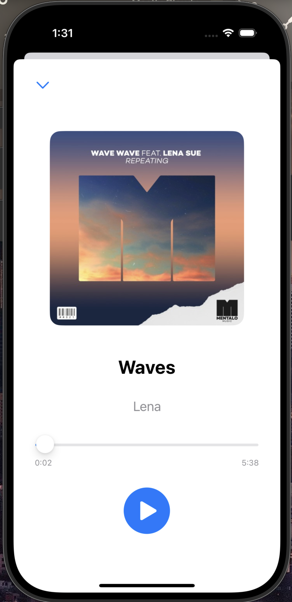
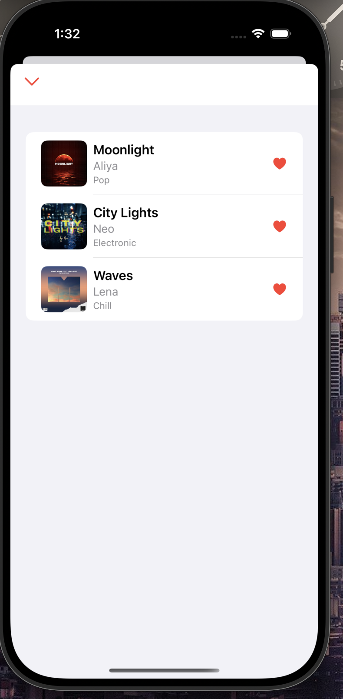

# PlayPod

PlayPod — это простое iOS-приложение для воспроизведения музыки, созданное на SwiftUI. Пока что начальная версия приложения как draft.

Что умеет приложение
- Показывает список треков с обложкой, названием и исполнителем.
- Можно воспроизводить музыку, ставить на паузу и переключать песни.
- Есть мини-плеер внизу экрана, который воспроизводится во всех частях приложения.
- Можно нажать на трек и открыть полноэкранный плеер.
- Можно добавлять треки в избранное. Они сохраняются и остаются после перезапуска.
- Есть отдельный экран “Избранное”.
- Также можно посмотреть альбомы и все песни в них.

Процесс создания приложения
- Сначала я создала список треков с обложками и текстом. Всё отображалось через List.
- Затем добавила AVAudioPlayer для воспроизведения локальных .mp3 файлов.
- Была реализована кнопка Play/Pause и логика переключения между треками.
- После этого появился мини-плеер. На этом этапе я поняла, что состояние плеера должно быть глобальным, иначе он не сможет работать между экранами. Именно тогда я полностью переписала архитектуру управления и добавила AudioPlayerManager как @EnvironmentObject.
- Я реализовала кнопку сердечка и сохраняла избранные треки через @AppStorage, чтобы данные сохранялись между сессиями. Также создала отдельный экран с фильтрацией избранного.
- Создала новый экран с большим изображением, названием, прогресс-баром и временем трека. Для управления прогрессом использовала Slider, который двусторонне связан с текущим временем.
- Добавила отдельную секцию с горизонтальным списком альбомов. При нажатии — открывается экран с треками этого альбома.

Интересные моменты
- Я использовала AudioPlayerManager с @EnvironmentObject, чтобы любое представление могло реагировать на изменения в плеере.
- Мини-плеер написан отдельно и помещён в ZStack, чтобы быть поверх всех экранов.
- Чтобы все кнопки работали независимо (например, сердечко не активировало переход), использовала PlainButtonStyle и правильную вложенность Button.

Нужна доработка
- Я использовала локальные .mp3 файлы вместо API, но в дальнейшем буду улучшать проект
- Пока нет анимаций или красивых переходов.
- Также нет режима перемешивания или повторения треков.

Почему я выбрала эти технологии
- SwiftUI — потому что удобно и быстро создавать интерфейс.
- AVAudioPlayer (из AVFoundation) — простой способ проигрывать музыку.
- @AppStorage и @EnvironmentObject — они помогают передавать данные и сохранять избранное.

Скриншоты

Обо мне
Меня зовут Anel Anuash.
Этот проект я сделала в рамках отбора на iOS-трек NFactorial 2025.
Мой GitHub: @anelli07
